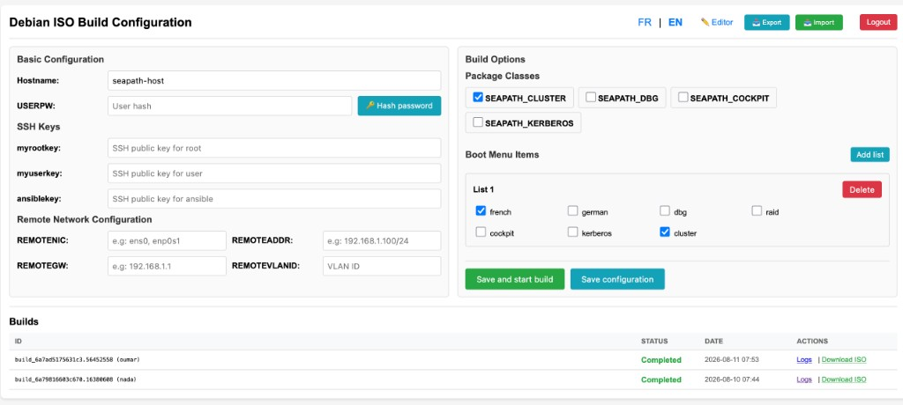
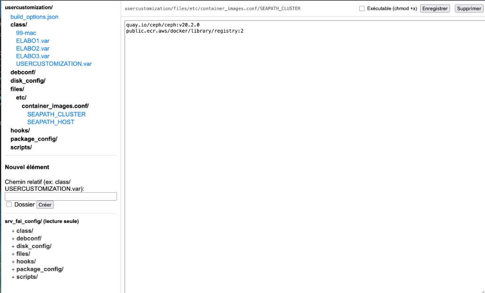
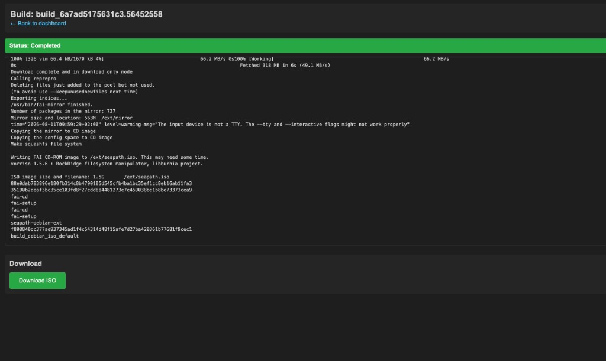

# ISOBuilder

A lightweight web interface to configure and build [SEAPATH](https://github.com/seapath/build_debian_iso) Debian ISO images using [FAI](https://fai-project.org/).

ISOBuilder wraps the upstream `build_iso.sh` workflow with a browser-based dashboard: configure host settings, pick package classes and GRUB boot menu entries, customize FAI files, and launch builds with live log streaming.

## Screenshots

### Dashboard

Configure hostname, credentials, SSH keys, package classes, and boot menu entries from a single page. Track builds and download finished ISOs.



### usercustomization editor

Browse and edit FAI customization files. The upstream `srv_fai_config/` tree is available read-only for reference.



### Build logs

Follow build output in real time. Download the ISO once the build completes.



## Features

- **Web dashboard** - configure hostname, passwords, SSH keys, and remote network settings from a single form
- **Dynamic build options** - package classes and boot menu flags are read from the cloned `build_iso.sh` script, so the UI stays aligned with the selected upstream branch
- **Build queue** - one build runs at a time; additional requests are queued automatically
- **Live logs** - follow build output in real time and download the resulting ISO when ready
- **usercustomization editor** - browse and edit FAI customization files, with read-only access to upstream `srv_fai_config/`
- **Import / export** - backup and restore `usercustomization/` as a ZIP archive (including file permissions)
- **Password hashing** - generate sha512crypt hashes for `USERPW` / `ROOTPW` directly from the UI
- **Internationalization** - English and French UI

## Architecture

```
Browser
   |
   v
PHP web app (ISOBuilder)
   |
   +-- /tmp/isobuilder_workspaces/<user>/build_debian_iso/   <- git clone (per user)
   |       +-- usercustomization/                           <- editable FAI config
   |
   +-- /tmp/isobuilder_builds/<build_id>/                  <- logs, status, output.iso
           +-- run_build.sh -> ./build_iso.sh --classes ... --menu ...
```

On login, each user gets a fresh clone of the upstream repository. Build options are saved in `usercustomization/build_options.json` alongside `class/USERCUSTOMIZATION.var`.

## Requirements

### Web server

- PHP 8.0+ with extensions: `session`, `json`, `zip`
- A web server (Apache, nginx, or PHP built-in server for development)
- `git`, `htpasswd` (Apache utils), and shell access for the PHP process

### Build host

ISOBuilder delegates the actual ISO creation to the upstream [build_debian_iso](https://github.com/seapath/build_debian_iso) project, which requires:

- **Podman** (with `podman-compose`)
- **sudo** access for the user running builds
- Sufficient disk space for container images and ISO output

The build host must be the same machine (or share the same filesystem) as the web server, since builds run locally via `nohup`.

## Installation

1. **Deploy the application**

   ```bash
   git clone <this-repo-url> /opt/isobuilder
   chown -R www-data:www-data /opt/isobuilder
   ```

2. **Configure the web server**

   Point your virtual host document root to `/opt/isobuilder` (or symlink it). Ensure PHP can execute shell commands (`git`, `podman`, etc.).

3. **Create authentication credentials**

   ISOBuilder reads users from `/opt/isobuilder/authlist.txt` in htpasswd format:

   ```bash
   htpasswd -B -c /opt/isobuilder/authlist.txt myuser
   chmod 640 /opt/isobuilder/authlist.txt
   chown root:www-data /opt/isobuilder/authlist.txt
   ```

   Supported hash formats: bcrypt (`$2y$`), Apache MD5 (`$apr1$`), SHA-1 (`{SHA}`).

4. **Adjust upstream settings (optional)**

   Edit `config.php` to change the cloned repository or branch:

   ```php
   define('SEAPATH_REPO_URL', 'https://github.com/seapath/build_debian_iso.git');
   define('SEAPATH_REPO_BRANCH', 'main');
   ```

5. **Ensure writable temp directories**

   The application stores workspaces and build artifacts under the system temp directory:

   - `/tmp/isobuilder_workspaces/`
   - `/tmp/isobuilder_builds/`

   The PHP process user must be able to create and write to these paths.

## Usage

### 1. Log in

Open the application in your browser and authenticate with your htpasswd credentials. On each login, the upstream repository is re-cloned to ensure you start from the latest version.

### 2. Configure the host

Fill in the dashboard form:

| Field | Description |
|-------|-------------|
| `HOSTNAME` | Target machine hostname |
| `USERPW` | User password hash (sha512crypt). Use the **Hash password** button to generate one |
| `myrootkey` / `myuserkey` / `ansiblekey` | SSH public keys injected during installation |
| `REMOTENIC` / `REMOTEADDR` / `REMOTEGW` / `REMOTEVLANID` | Optional out-of-band network configuration |

### 3. Select build options

- **Package classes** - FAI classes included in the ISO (e.g. `SEAPATH_CLUSTER`, `SEAPATH_DBG`). Options are parsed from `build_iso.sh`.
- **Boot menu items** - GRUB entry flag combinations (e.g. `french,cluster`). You can define multiple lists; the first list becomes the default boot entry.

Click **Save configuration** to persist without building, or **Save and start build** to launch immediately.

### 4. Monitor and download

Build status appears on the dashboard. Click **Logs** to stream output in real time. When the build completes successfully, download the ISO from the dashboard or the logs page.

### 5. Advanced customization

Use the **Editor** to modify any file under `usercustomization/` - disk layouts, hooks, package lists, and more. The upstream `srv_fai_config/` tree is available read-only for reference.

Export your customization as a ZIP for backup or import it on another instance.

## Build queue

Only one build runs at a time (enforced by a mutex file). If a build is already in progress, new requests are placed in a FIFO queue and started automatically when the current build finishes.

On logout, all pending and running builds owned by the user are cancelled and their workspace is cleaned up.

## Project structure

```
.
├── index.php                  Login page
├── dashboard.php              Main configuration UI
├── build.php                  Save config and trigger builds
├── editor.php / editor_api.php  File tree editor
├── auth.php                   htpasswd authentication
├── config.php                 Paths, repo settings, build helpers
├── hash_password.php          sha512crypt password hashing API
├── export_usercustomization.php
├── import_usercustomization.php
├── stream_logs.php            Server-sent log streaming
├── start_next_build.php       Queue worker (CLI)
└── i18n/                      English and French translations
```

## Security notes

- Authentication relies on `/opt/isobuilder/authlist.txt`; protect this file accordingly.
- Builds run shell commands (`git`, `podman`, `build_iso.sh`) as the web server user. Restrict server access to trusted operators only.
- User workspaces and build artifacts live in `/tmp/` and are removed on logout.

## License

See the upstream [build_debian_iso](https://github.com/seapath/build_debian_iso) project for SEAPATH licensing terms.
